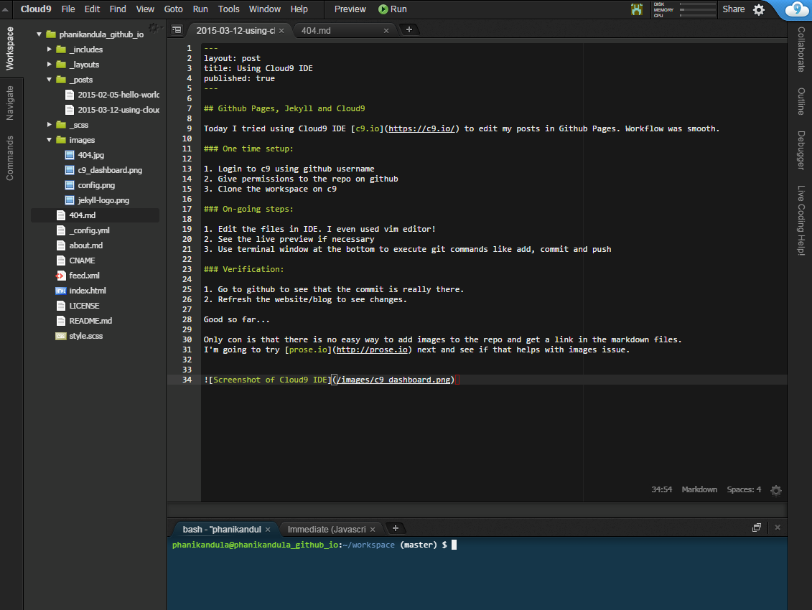
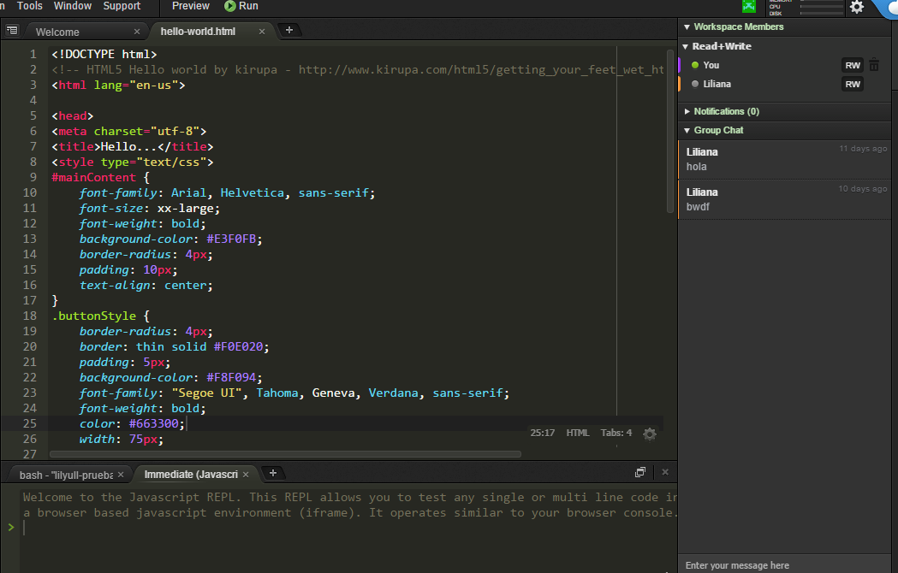
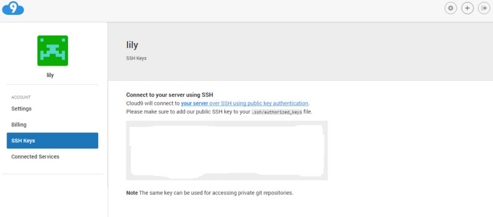

# Cloud 9

* Autor: [Edna Liliana Galiano Camacho](https://github.com/alu0100762846)
* Fecha: 09/12/2016


Cloud9 IDE es un entorno de desarrollo integrado en línea, publicado como código abierto desde la versión 3.0. Soporta cientos de lenguajes de programación, incluyendo C, C ++, PHP, Ruby, Perl, Python, JavaScript con Node.js y Go. Permite a los desarrolladores comenzar con la codificación de forma inmediata con espacios de trabajo preconfigurados, colaborar con sus compañeros con funciones de codificación colaborativa y características de desarrollo web como la previsualización en vivo y las pruebas de compatibilidad de navegadores.


Se escribe casi enteramente en JavaScript y usa Node.js en el back-end. El componente de editor utiliza Ace. A partir de julio de 2014, utiliza contenedores Docker para sus espacios de trabajo,  y está alojado en Google Compute Engine. La compañía tiene oficinas en San Francisco y Amsterdam.

## Desarrollar y probar en un entorno real

Cloud9 (c9) te ofrece un servidor virtual para ti, con el que puedes almacenar tu código y probar las aplicaciones. Cuando desarrollas estás escribiendo sobre los archivos reales "en caliente" de tu servidor de pruebas, por lo que cualquier cambio actualiza al instante el sitio web que estás produciendo en c9.

## Ventajas

Entre las ventajas de este VPS con respecto a lo que puedes conseguir con el desarrollo local:
_Sin configuración:_ Con crear tu usuario puedes disponer de tu servidor listo para usar con los lenguajes más habituales.
_Probar en un entorno más real:_ Puedes probar tu código en un entorno más real que a través de "localhost". En un dominio remoto, de Internet y un sistema operativo habitual en sitios en producción.
_Posibilidad de compartir con otras personas:_ sin que tengan que hacer nada en especial.
_Trabajar desde cualquier ordenador:_ con el único requisito que esté conectado a Internet y sin tener que instalar ningún software en ese ordenador.

## Más características

Acceso a la consola de comandos del servidor, la consola Linux, donde podremos instalar todo tipo de aplicaciones, extensiones



En cuanto a funcionalidades del editor de código, son equiparables a los editores offline, con ayudas contextuales a la programación inteligentes, gestión de varios archivos al mismo tiempo, depurador de código, atajos de teclado, personalización del editor, previsualización de tu código en marcha, etc. Incluso tiene algunas funcionalidades que no encuentras en los editores de código habitualmente, como un histórico de las versiones de tus archivos (a lo largo de los puntos "los guardados") o un sencillo editor de imágenes online.


## Trabajo en equipo

Se puede crear un "workspace" o proyecto y compartirlo con otros usuarios de Cloud 9. A partir de entonces podemos compartir no sólo el código de los archivos del servidor, sino también la consola de comandos.

Cuando una persona accede a un archivo abierto por otro componente del equipo de trabajo encontrarás que se ven dos cursores en el código. Uno es el tuyo y otro es el de las otras personas que lo tengan abierto. Podéis escribir código ambos al mismo tiempo! con lo que verás los cambios que estás haciendo en el documento y los que está haciendo tu compañero en tiempo real. Es ideal para hacer "pair programming".



Otra de las ventajas es que podemos lanzar nuestros comandos y ver los resultados de los comandos lanzados por nuestros compañeros en el mismo espacio de trabajo.También puedes compartir con tus compañeros mensajes en el chat integrado que podemos observar a la derecha de la imagen.

## Acceso a MySQL

En Cloud 9 podemos usar MySQL. A continuación se explica nuestra primera iteración de soporte de MySQL en Cloud9. Esto hace que sea muy fácil de instalar, iniciar y detener una instancia de MySQL justo en su espacio de trabajo. Lo bueno es que cada espacio de trabajo se ejecutará una base de datos independiente para que sus proyectos no interferirán entre sí. Puede controlar MySQL con la mysql-ctl herramienta de línea de comandos ejecutar desde el terminal :

```bash
# start MySQL. Will create an empty database on first start
$ mysql-ctl start

# stop MySQL
$ mysql-ctl stop

# run the MySQL interactive shell
$ mysql-ctl cli
```

### A continuación, vemos como puede conectarse a la base de datos con los siguientes parámetros

_Nombre de host_ - $IP(La misma IP local ya que la aplicación se ejecuta en Cloud9)
_Puerto_ - 3306(El número de puerto por defecto de MySQL)
_Usuario_ - $C9_USER(Su nombre de usuario Cloud9)
_Contraseña_ - "" (sin contraseña ya que sólo se puede acceder a la base de datos desde dentro del área de trabajo)
_Base de datos_ - c9(El nombre de usuario de base de datos)
Para verificar su nombre de host, puede conectarse a la CLI mysql y mostrar el host ejecutando los siguientes comandos:

```bash
mysql-ctl cli
```

### Una vez conectado a la carcasa MySQL, ejecute lo siguiente

```bash
select @@hostname;
```

## Importación de datos en su base de datos

Para importar los datos existentes en su base de datos de ejecución siguientes comandos:

```bash
mysql-ctl cli
```

Ahora se encuentra en el entorno de MySQL y puede comenzar la importación:

```bash
mysql> use c9
mysql> source PATH_TO_SQL_FILE.sql
```

Para comprobar que todo se puso de ejecución importados:

```bash
mysql> show tables;
```

## Soporte para los siguientes repositorios de código

*GitHub

*Bitbucket

*Repositorios Mercurial

*Repositorios Git

*Servidores FTP

Cloud 9 nos permite conectar con distintos repositoriosde cógido. Ésto lo hace por medio de la clave ssh que nos proporciona este IDE.


