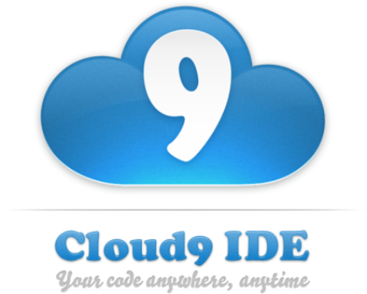
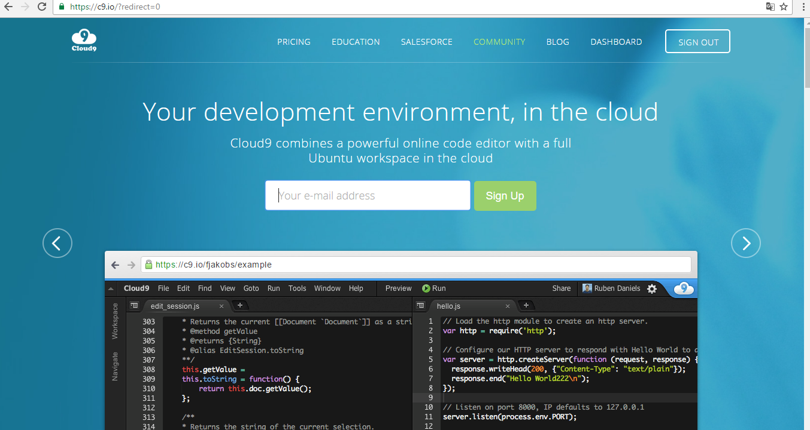

# Cloud 9

* Autor: [Edna Liliana Galiano Camacho](https://github.com/alu0100762846)
* Fecha: 09/12/2016
* Presentación: [Cloud 9](./index.html)
* 

Cloud9 IDE es un entorno de desarrollo integrado en línea, publicado como código abierto desde la versión 3.0. Soporta cientos de lenguajes de programación, incluyendo C, C ++, PHP, Ruby, Perl, Python, JavaScript con Node.js y Go. Permite a los desarrolladores comenzar con la codificación de forma inmediata con espacios de trabajo preconfigurados, colaborar con sus compañeros con funciones de codificación colaborativa y características de desarrollo web como la previsualización en vivo y las pruebas de compatibilidad de navegadores.

Se escribe casi enteramente en JavaScript y usa Node.js en el back-end. El componente de editor utiliza Ace. A partir de julio de 2014, utiliza contenedores Docker para sus espacios de trabajo,  y está alojado en Google Compute Engine. La compañía tiene oficinas en San Francisco y Amsterdam.

##Desarrollar y probar en un entorno real

Cloud9 (c9) te ofrece un servidor virtual para ti, con el que puedes almacenar tu código y probar las aplicaciones. Cuando desarrollas estás escribiendo sobre los archivos reales "en caliente" de tu servidor de pruebas, por lo que cualquier cambio actualiza al instante el sitio web que estás produciendo en c9. 

##Ventajas 

Entre las ventajas de este VPS con respecto a lo que puedes conseguir con el desarrollo local:
_Sin configuración:_ Con crear tu usuario puedes disponer de tu servidor listo para usar con los lenguajes más habituales. 
_Probar en un entorno más real:_ Puedes probar tu código en un entorno más real que a través de "localhost". En un dominio remoto, de Internet y un sistema operativo habitual en sitios en producción. 
_Posibilidad de compartir con otras personas:_ sin que tengan que hacer nada en especial. 
_Trabajar desde cualquier ordenador:_ con el único requisito que esté conectado a Internet y sin tener que instalar ningún software en ese ordenador.

##Más características 

Acceso a la consola de comandos del servidor, la consola Linux, donde podremos instalar todo tipo de aplicaciones, extensiones

En cuanto a funcionalidades del editor de código, son equiparables a los editores offline, con ayudas contextuales a la programación inteligentes, gestión de varios archivos al mismo tiempo, depurador de código, atajos de teclado, personalización del editor, previsualización de tu código en marcha, etc. Incluso tiene algunas funcionalidades que no encuentras en los editores de código habitualmente, como un histórico de las versiones de tus archivos, a lo largo en los guardados o un sencillo editor de imágenes online.

