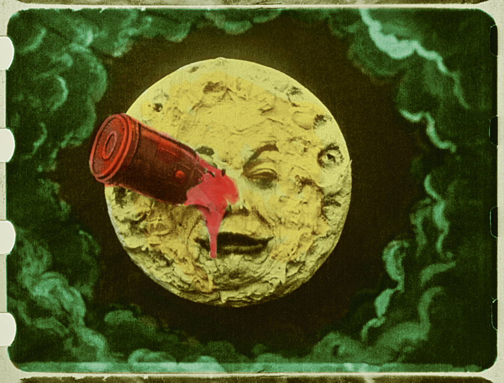

# 3. Edición
El proceso de edición de un vídeo consiste en añadir, eliminar o modificar los fotogramas existentes de un archivo de vídeo. 

Antiguamente todas estas modificaciones se realizaban de manera física, es decir, si era necesario eliminar alguna escena grabada, esta se recortaba del rollo de la película y posteriormente se pegaba con la otra parte a la que coincidía. Así mismo, hay casos como el de Viaje a la Luna (1902) de Georges Méliès en el que cada fotograma se pintó a mano en una empresa en la que trabajaban 300 mujeres. El fotograma coloreado se puede apreciar al final de esta página.

Debemos distinguir entre edición y montaje, ya que el primero hace referencia más a la edición digital, mientras que el segundo concepto se refiere mayoritariamente a la modificación física de la cinta.

  
[Fuente de la imagen](http://ravepad.com/page/serge-hazanavicius/images/view/4579187/Bella-ciao-film-review-2001-Stephane-Giusti)
