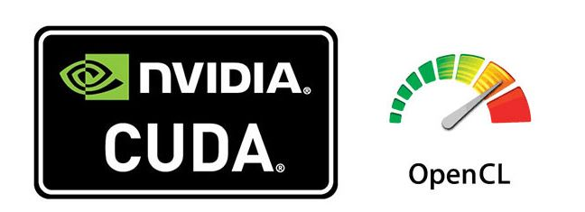

# 6. Procesado
Uno de los aspectos en lo que más se puede profundizar en el vídeo digital es el del procesado, es decir, todo lo relacionado con como se almacena el vídeo obtenido de una cámara, o como se consigue un archivo de vídeo final al que se le añaden efectos, etc. 

El primer elemento que veremos es el de renderizado. Este concepto hace referencia a los cálculos que realiza un ordenador para generar un producto final. En nuestro caso hablamos de ficheros de vídeo, pero esto se puede aplicar a cualquier ámbito de la informática, como por ejemplo, a la hora de cargar una página web, el navegador está renderizando la página que vemos al final. Por ello, el mejor sinónimo que define el renderizado es el de cocinar, ya que lo que hacemos es tener nuestras pistas de audio, vídeo, efectos, etc, y buscamos crear un producto final, como si de una receta con sus ingredientes se tratase.

## CPU vs GPGPU
El principal problema del renderizado es la elevada cantidad de potencia que necesitamos de un procesador para que nos genere un fotograma, aunque también depende de la resolución en la que lo queramos, si está comprimido o no, si es una escena 3D con polígonos generados enteramente por ordenador, etc. Hasta hace unos pocos años todos esos cálculos los realizaba la CPU, lo que ocasionaba con un único fotograma de una película de animación en 3D tardase horas en generarse. Sin embargo, existía un componente con mucha potencia que estaba desaprovechado en estas tareas, y era las tarjetas gráficas. 

Las GPUs cuenta con miles de núcleos, que si bien no están orientados a realizar el mismo cálculo que una CPU, permiten reducir el tiempo de renderizado. Es en este momento en el que entra el término GPGPU, la computación de propósito general en unidades de procesamiento gráfico. La primera empresa en jugar en este terreno fue NVIDIA con su conjunto de herramientas CUDA en 2007, las cuales permiten aprovechar el paralelismo y el ancho de banda de la memoria de las tarjetas gráficas de una manera impresionante, a pesar de flaquear en aspectos como los números en precisión simple o no los problemas que existe si se interactua con otros lenguajes OpenGL, donde este tiene acceso a la memoria de CUDA, pero CUDA no puede acceder a la memoria de OpenGL.

El principal defecto de CUDA es que es exclusivo de las tarjetas de esta marca, lo que provoca un desaprovechamiento en otras como AMD. Por ello, Apple decidió lanzar OpenCL en 2009, una alternativa libre en la cuál se busca utilizar las CPUs, GPUs y demás conjunto de hardware de una manera que permita ejecutar aplicaciones entre ellos sin problemas. En este caso, ya no hay problema con la marca que se utilice en la tarjeta gráfica, ya que los dos principales fabricantes, AMD y Nvidia, forman parte del conjunto de empresas que mantienen a este framework. Tanto CUDA como OpenCL estan escritos en una modificación del lenguaje C.

A pesar de que Nvidia soporta tanto CUDA como OpenCL, es la primera alternativa la que ofrece de media un mejor rendimiento.

  
[Fuente de la imagen](http://hardzone.es/2014/03/09/nvidia-lanza-la-version-6-de-su-sdk-cuda/)