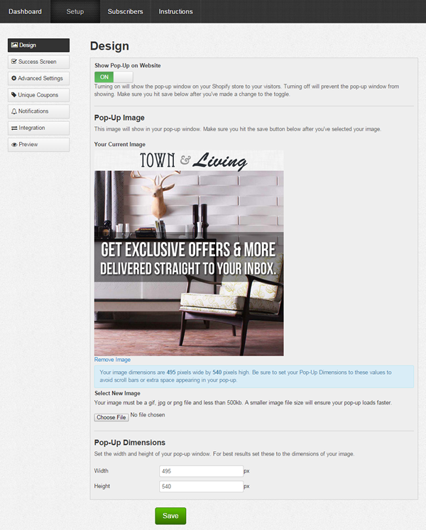
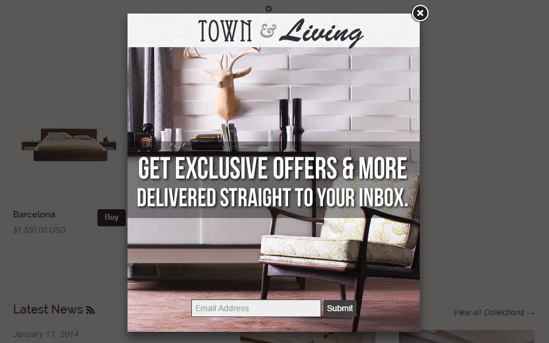
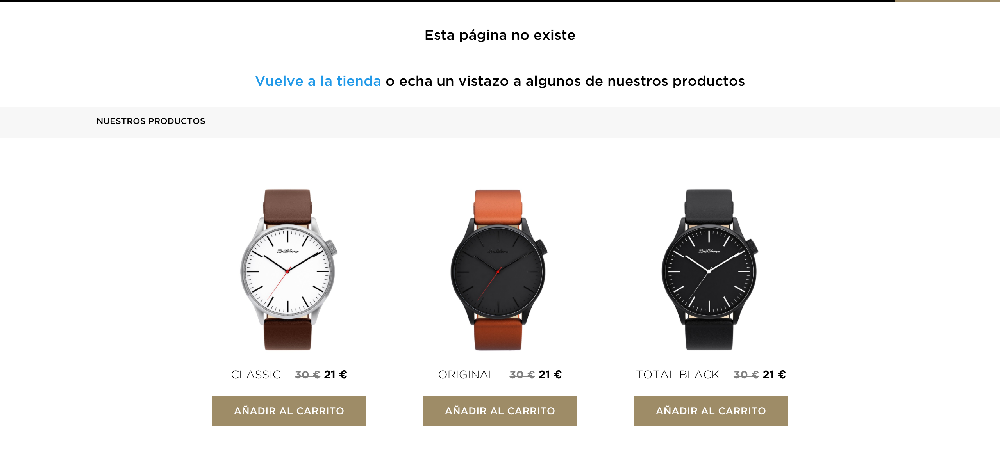

# 4. Shopify

Los plug-in de los cuales hace uso Shopify no es desarrollado por la propia empresa (que también) si no que dispone de un "market" como si de una aplicación movil se tratase con una comunidad de developers. Dicha comunidad recibe por venta de cada aplicación un 80% de los beneficios, es decir que estamos hablando de ganancias por partida doble de shopify, tanto para aquellos usuarios a los que le vente la plataforma de E-Commerce como un 20% por cada aplicación que se vende.

Por otro lado, Shopify también tiene un modelo de negocio para diseñadores, los cuales facilitan los temas que puedes comprar.

**Shopify APP Store:** Ofrece una interfaz muy intuitiva y entendible para cualquier usuario permitiendo hacer busquedas mas detalladas según la categoría o el costo de dicha aplicación.


El proceso de dar de alta una aplicación en nuestra web es muy sencillo , solo tenemos que pusar sobre "GET"


Posteriormente, solo tendremos que decir cual es nuestro dominio y someternos a un proceso de autenticación, la aplicación será isntalada en aquella parte del servidor que Shopify tiene para nuestra tienda online.


## Aplicaciones de pago

***Pop-Up Window***: Dicha aplicación se encarga de crear pop-ups que dan información sobre articulos en oferta, recomiendan que pongas tu email para recibir todas las ofertas.. etc. Tiene integración con MAILCHIMP (gestor de mailing).

Como podemos ver en la siguiente imagen, la configuración, es rápida y sencilla.



Y nos quedaría algo similar a lo siguiente:



***Countdown Timer Bar:*** Esta aplicación nos permite crear y editar con bastante facilidad una cuenta atras que se colocará en forma de barra en el top de nuestra web


***Weglot Translate:*** Esta app ofrece la posibilidad de traducir nuestra tienda a los idiomas que queramos de forma automática.


***Instagram shop by Snapppt*** Esta aplicación nos permite tener un modelo de tienda que cada vez se está usando más, como es que te muestren todas las imagenes de su cuenta en instagram y puedas comprar directamente los accesorios que salen en las fotos.


## API de Shopify

Para ver como trabaja la API de Shopify y entender lo sencillo que puede ser crear una aplicación para shopify haremos uso del ejemplo de manejar descuentos dentro de la aplicación, también usaremos el paquete NPM shopify-node-api.

***Crear una instancia:***

```javascript
var Shopify = new shopifyAPI({
shop: 'MYSHOP', // MYSHOP.myshopify.com
shopify_api_key: '', // Your API key
shopify_shared_secret: '', // Your Shared Secret
access_token: 'token', //permanent token
});
```

***GET***

Con lo siguiente podemos obtener todos los descuentos que nuestra tienda tiene activos.

```javascript
Shopify.get('/admin/discounts.json', query_data, function(err, data, headers){
console.log(data);
console.log(headers); // Headers returned from request
});
```

***POST***
Con la siguiente sentencia podemos crear un descuento del 15% para nuestra tienda.

```JSON
var post_data = {
  "discount": {
    "discount_type": "percentage",
    "value": "15.0",
    "code": "balderdash"
  }
}
```

```javascript
Shopify.post('/admin/discounts.json', post_data, function(err, data, headers){
console.log(data);
});
```

***Desabilitar un descuento***

```javascript
Shopify.post('/admin/discounts/#{id}/disable.json', function(err, data, headers){
console.log(data);
});
```

***Eliminar descuento***

```javascript
Shopify.delete('/admin/discounts/#{id}.json', function(err, data, headers){
  console.log(data);
});
```

## Liquid

Liquid es esencial para hacer el mejor uso de Shopify, en Liquid nos podemos encontrar dos tipos de tags: De Texto y Lógicos.
* Tags de texto (que pueden devolver texto) están envueltos por {{ llaves dobles de apertura y cierre (se ven así) }}
* Tags lógicos (que nunca devuelven texto) están envueltos por

***Ejemplo de if/else con Liquid***

```html

   <h1>Usted bi tiene asignada tarjeta de credito</h1>

```

Esto es un simple ejemplo, teniendo un lenguaje similar a los ya frecuentados en la facultad, pero hay ejemplos mas complejos en liquid, el siguiente que voy a poner es de una mediana empresa que conozco y ha facilitado el código.

```html
ly_global_beginly_global_end
<div class="empty-cart__container">
  <div class="row">
    <div class="small-12 columns">
      <h1 class="empty-cart__title text-center"><ly-as-2196376>Esta página no existe</ly-as-2196376></h1>
    </div>
    <div class="small-12 columns text-center">
      <p><a href="/"><ly-as-2196377>Vuelve a la tienda</ly-as-2196377></a> <ly-as-2196378>o echa un vistazo a algunos de nuestros productos</ly-as-2196378></p>
    </div>
  </div>
  <div class="title-collection column text-center">
    <div class="row">
      <h2 class="small-12 large-10 large-offset-1 columns"><ly-as-2196379>Nuestros productos</ly-as-2196379></h2>
    </div>
  </div>
  
</div>
```
El ejemplo anterior, visualmente aporta lo siguiente:



Por Aitor Bernal Falcón utilizando [esta presentación.](https://docs.google.com/presentation/d/1XYNEGRDBkWOTlBVp8MwLQzGtYB4JGJCoTWTQy8STa98/edit?usp=sharing)
